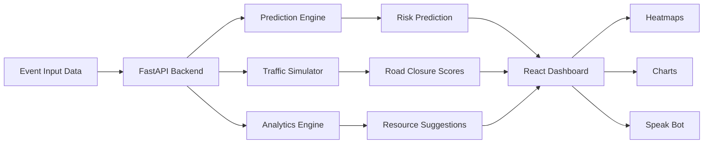
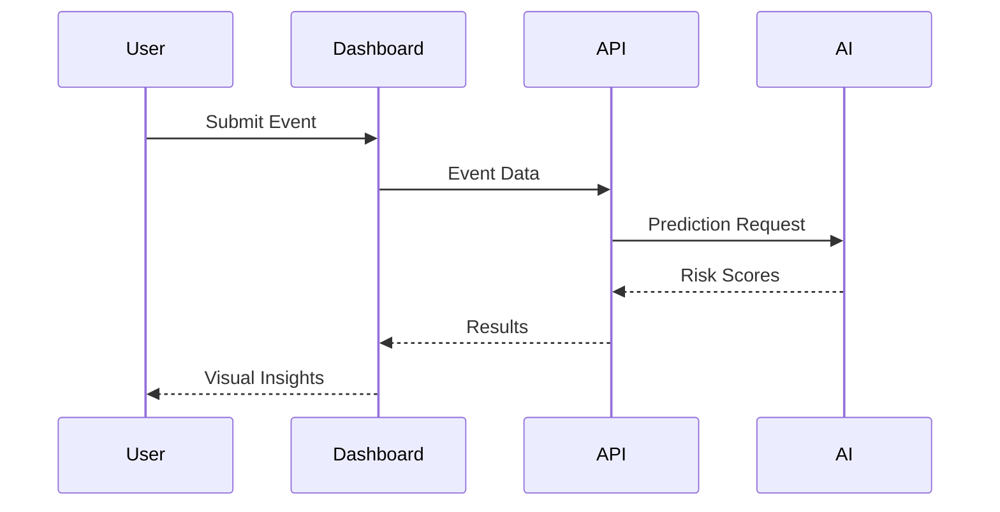

# 🚦 EventPulseAI


<p align="center">

</p>

<p align="center">


</p>

---


---

# 🌟 Overview

EventPulseAI is an AI-driven traffic intelligence platform that helps city administrators, law enforcement agencies, and event organizers predict and manage traffic disruptions caused by large public events.

### Key Capabilities

* 🚧 Road Closure Prediction
* 🚦 Traffic Impact Forecasting
* 👮 Resource Planning
* 🚓 VIP Movement Simulation
* 🗺️ Risk Heatmaps
* 📊 Event Analytics
* 🎤 Speak Bot Assistant

---

# 🏗️ System Architecture



---

# 🚀 Features

| Feature                    | Description                   |
| -------------------------- | ----------------------------- |
| 🚧 Road Closure Prediction | AI-based closure probability  |
| 🚦 Traffic Impact Analysis | Predict congestion levels     |
| 🚓 VIP Route Simulation    | Simulate movement disruptions |
| 👮 Resource Allocation     | Police & barricade planning   |
| 📊 Analytics Dashboard     | Event statistics              |
| 🗺️ Heatmaps               | High-risk area detection      |
| 🎤 Speak Bot               | Voice-guided assistance       |

---

# 📂 Project Structure

```text
EventPulseAI
│
├── frontend
│   ├── src
│   ├── public
│   ├── package.json
│   └── vite.config.js
│
├── backend
│   ├── app.py
│   ├── services
│   ├── models
│   ├── artifacts
│   └── requirements.txt
│
├── render.yaml
├── DEPLOY_RENDER.md
└── README.md
```

---

# ⚡ Quick Start

## Frontend

```bash
cd frontend

npm install

npm run dev
```

Frontend runs at:

```text
http://localhost:5173
```

---

## Backend

```bash
cd backend

pip install -r requirements.txt

uvicorn app:app --host 127.0.0.1 --port 8001
```

Backend runs at:

```text
http://127.0.0.1:8001
```

---

# 🔧 Environment Variables

Create `.env`

```env
VITE_API_URL=http://127.0.0.1:8001
```

---

# 🔄 Workflow



---

# 📈 Analytics Modules

### 🎯 Event Impact Prediction

Predicts traffic surge generated by an event.

### 🚧 Road Closure Probability

Identifies likely road blocks.

### 🚓 VIP Movement Simulation

Calculates disruption caused by VIP convoys.

### 👮 Resource Recommendation

Suggests:

* Police Personnel
* Barricades
* Diversions
* Emergency Units

### 🗺️ Hotspot Detection

Identifies critical congestion zones.

---


---

# 🧠 Tech Stack

| Layer      | Technology   |
| ---------- | ------------ |
| Frontend   | React        |
| Styling    | Tailwind CSS |
| Backend    | FastAPI      |
| AI Models  | Scikit-Learn |
| Maps       | Leaflet      |
| Charts     | Recharts     |
| Deployment | Render       |

---

# ☁️ Deployment

## Render Blueprint

```bash
render.yaml
```

### Steps

1. Push code to GitHub
2. Open Render
3. New + Blueprint
4. Select repository
5. Deploy

---

# ✅ Validation

## Frontend

```bash
npm run lint

npm run build
```

## Backend

```bash
python -m py_compile app.py
```

---


---

# 🌍 Future Scope

* Real-Time Traffic Data Integration
* Google Maps API
* CCTV-Based Monitoring
* Emergency Response Routing
* Reinforcement Learning Optimization
* Smart City Command Center Integration

---

# 🤝 Contributors

Made with ❤️ for Smart City Traffic Intelligence

---

<p align="center">

⭐ If you like this project, please star the repository ⭐

</p>


